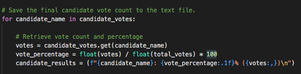
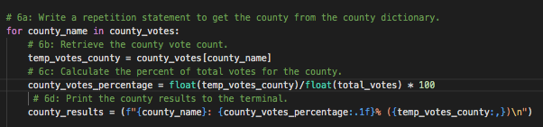

# Election-Analysis
------------------------------------------------------

## Overview of the Election Audit
The purpose of this project was to assist a Colorado Board of Elections employee named "Tom" in succesfully creating a code, using python programming language, to automate an election audit so that this script may be verified for potential use in other congressional and senatorial districts, as well as local elections.  In order to perform the audit, the script was written in Visual Studio Code and a myriad of coding techniques were applied to extract the election data from a csv file, perform calculations to reveal pertinant election results for each candidate and county, and to store these pertinent results onto a separate text file.  Consequently, this text file allowed for a concise display of the audit's results so that it may be well-suited to share with the associated election committee.

----------------------------------------

## Resources:
- Data Source:  election_results.csv
- Software:  Python 3.8.3, Visual Studio Code, 1.49.2
----------------------------------------

## Election Audit Results:

By utilizing the python script, the following results were easily generated:

- 369,711 total votes were cast in the congressional election
- For each county in the precinct, the total number of votes and the percentage of the total votes were as follows:  

        - Jefferson: 10.5% (38,855)
        - Denver: 82.8% (306,055)
        - Arapahoe: 6.7% (24,801)
- As we can see (above), Denver had the largest number of votes
- For each candidate, the number of votes and the percentage of the total votes each candidate received were as follows:

      - Charles Casper Stockham: 23.0% (85,213)
      - Diana DeGette: 73.8% (272,892)
      - Raymon Anthony Doane: 3.1% (11,606)

- The winning candidate of the election, their total vote count, and their percentage of the total votes were as follows:

      - Winner: Diana DeGette
      - Winning Vote Count: 272,892
      - Winning Percentage: 73.8%

## Election-Audit Summary:

As evidenced by the results of this project, it is clear the python script was able to flawlessly perform all the necessary steps of extracting the dataset, processing it, and outputting the desired results into a concise, readable format.  However, the potential use of this code extends well beyond the confines of one single election audit.  In fact, the code script is flexible enough to be used for any election, as the variables in the code are entirely customizable to accommodate accordingly.

For example, the code for identifying the number of votes for each candidate in this project employed the use of conditional statements and "for loops" which, together, accurately tallied and assigned each candidates' votes automatically, without the user having to specify the number of candidates, their names, their order within the dataset, or the number of ballots cast.  We simply had to initialize variables to accumulate data from the loops and to ensure the for loop focused on the appropriate row in the dataset and the code script was able to output the desired results with ease.  This means the code could be applied to any candidates in any election, regardless of the number of candidates, their names, or the size of the ballots.  In the following screenshot, we see the code specified to loop row three, which contained the candidate names:

As another example of how flexible this code can be, the script is also adaptable to tallying the totals and percentages of more than just candidates.  In fact, it is entirely customizable for tallying any variable of choice.  For instance, the process of calculating the total, percentage, and highest number of votes for each candidate in this project was exactly the same process as was used to find the same result criterias for each county in the dataset.  We only had to adjust the variables accordingly.  To illustrate, in the following two screenshots, the first displaying a portion of code analyzing candidate data and the second displaying a poriton analyzing counties, we can see that although each code is customized according to the variables at hand, the code format is essentially unchanged and is able to conveniently perform the same overall function to each variable:

---------------------------------------------------

---------------------------------------------

----------------------------------------------------

In conclusion, it clear this python script is a viable and flexible tool for calculating, processing, and displaying the results of an election audit.  Provided there is access to an extractable tabulated dataset, the customizability and efficiency of this code make it an excellent source for automating election results analyses which can be easily adopted for use in other congressional and senatorial districts, as well as local elections.